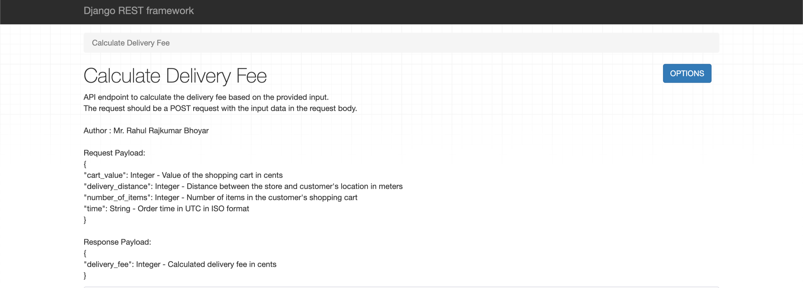
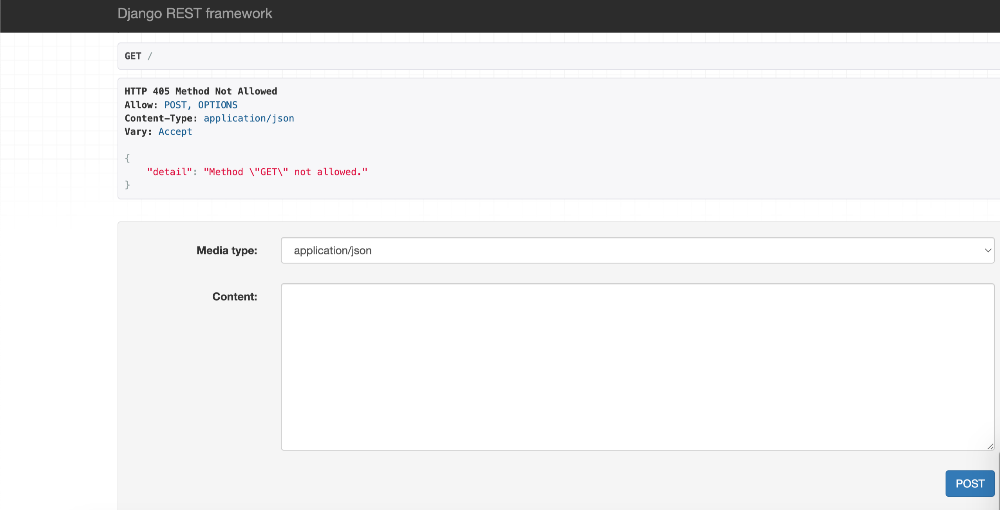

# Delivery Fee Calculator

---

## Wolt Summer 2024 Engineering Internships Project

#### Author : Mr. Rahul Bhoyar

#### Date : 26/01/2024

---

This Django application provides an HTTP API for calculating the delivery fee based on various parameters such as cart value, delivery distance, number of items, and order time.






## Table of Contents

* [Delivery Fee Calculator](https://chat.openai.com/c/f941833b-2591-4bc6-ab87-6597628db058#delivery-fee-calculator)
  * [Table of Contents](https://chat.openai.com/c/f941833b-2591-4bc6-ab87-6597628db058#table-of-contents)
  * [Specifications](https://chat.openai.com/c/f941833b-2591-4bc6-ab87-6597628db058#specifications)
  * [Requirements](https://chat.openai.com/c/f941833b-2591-4bc6-ab87-6597628db058#requirements)
  * [Installation](https://chat.openai.com/c/f941833b-2591-4bc6-ab87-6597628db058#installation)
  * [Usage](https://chat.openai.com/c/f941833b-2591-4bc6-ab87-6597628db058#usage)
  * [API Endpoints](https://chat.openai.com/c/f941833b-2591-4bc6-ab87-6597628db058#api-endpoints)
  * [Testing](https://chat.openai.com/c/f941833b-2591-4bc6-ab87-6597628db058#testing)
  * [Contributing](https://chat.openai.com/c/f941833b-2591-4bc6-ab87-6597628db058#contributing)

---

## Specifications

*The delivery fee is calculated according to the following rules:*

* If the cart value is less than 10€, a small order surcharge is added to the delivery price. The surcharge is the difference between the cart value and 10€. For example if the cart value is 8.90€, the surcharge will be 1.10€.
* A delivery fee for the first 1000 meters (=1km) is 2€. If the delivery distance is longer than that, 1€ is added for every additional 500 meters that the courier needs to travel before reaching the destination. Even if the distance would be shorter than 500 meters, the minimum fee is always 1€.

  * Example 1: If the delivery distance is 1499 meters, the delivery fee is: 2€ base fee + 1€ for the additional 500 m => 3€
  * Example 2: If the delivery distance is 1500 meters, the delivery fee is: 2€ base fee + 1€ for the additional 500 m => 3€
  * Example 3: If the delivery distance is 1501 meters, the delivery fee is: 2€ base fee + 1€ for the first 500 m + 1€ for the second 500 m => 4€
* If the number of items is five or more, an additional 50 cent surcharge is added for each item above and including the fifth item. An extra "bulk" fee applies for more than 12 items of 1,20€

  * Example 1: If the number of items is 4, no extra surcharge
  * Example 2: If the number of items is 5, 50 cents surcharge is added
  * Example 3: If the number of items is 10, 3€ surcharge (6 x 50 cents) is added
  * Example 4: If the number of items is 13, 5,70€ surcharge is added ((9 * 50 cents) + 1,20€)
  * Example 5: If the number of items is 14, 6,20€ surcharge is added ((10 * 50 cents) + 1,20€)
* The delivery fee can __never__ be more than 15€, including possible surcharges.
* The delivery is free (0€) when the cart value is equal or more than 200€.
* During the Friday rush, 3 - 7 PM, the delivery fee (the total fee including possible surcharges) will be multiplied by 1.2x. However, the fee still cannot be more than the max (15€). Considering timezone, for simplicity, **use UTC as a timezone in backend solutions** (so Friday rush is 3 - 7 PM UTC). **In frontend solutions, use the timezone of the browser** (so Friday rush is 3 - 7 PM in the timezone of the browser).

---

### Requirements

* Python (version compatible with Django) (Python 3.8 or greater)
* Django
* Django Rest Framework

---

## Installation

1. Download the folder and save it on your local machine.
2. Open the folder in IDE (for ex VS Code, Pycharm etc). Make sure that the terminal is pointing to current working directory. (i.e delivery_fee_calculator)
3. Install dependencies:

   ```
       pip install -r requirements.txt
   ```
4. Migrate the database:

   ```
        python manage.py makemigrations
   ```

```
         python manage.py migrate
```

---

## Usage

Run the development server:

```
python manage.py runserver
```

The API will be accessible at [http://localhost:8000/]().

---

## API Endpoints

**POST**

* Calculate the delivery fee based on the input parameters.
* Request Body Example:

  {
  "cart_value":790,
  "delivery_distance":2235,
  "number_of_items":4,
  "time":"2024-01-15T13:00:00Z"
  }

---

## Testing

Run the tests using the following command:

```
python manage.py test
```

---

## Contributing

Contributions are welcome! Please open an issue or submit a pull request.

Here is the Git Repository link :

**[https://github.com/rahulbhoyar1995/wolt-engineering-internship-2024.git]()**
